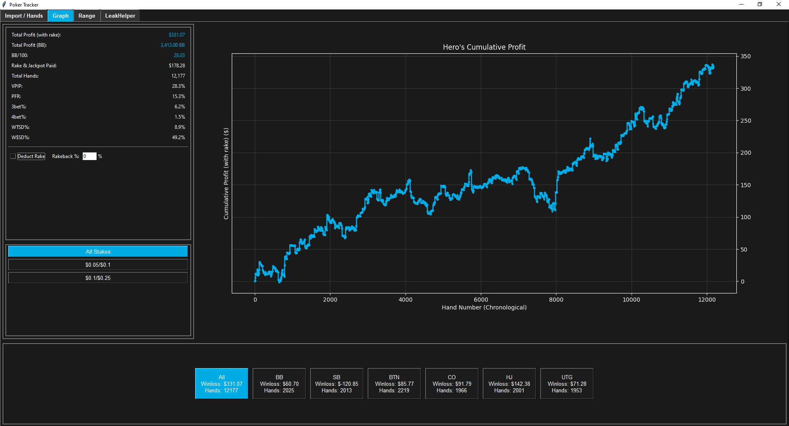
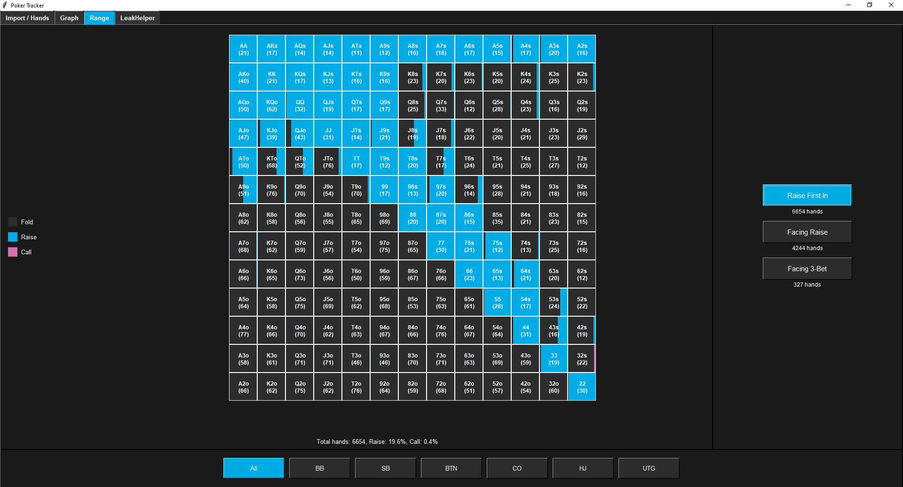
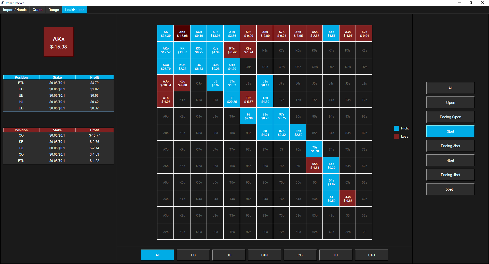

# PokerVision

A robust Python application for importing, parsing, and analyzing poker hand histories. Designed with a sleek graphical interface and powerful statistical tools, PokerVision empowers you to dive deep into your game performance.

---

## 🎥 Demo Video

Watch a quick demo of PokerVision in action:  
👉 [PokerVision Demo on YouTube](https://youtu.be/lnkThdlEaV4)

---

## Overview

PokerVision streamlines the process of collecting and analyzing hand histories. Built on Python with a Tkinter GUI, it leverages a local SQLite database to store comprehensive details for each hand, enabling detailed profit analysis, positional insights, and performance tracking.

Below are a few screenshots of the interface:

  
*Displays the cumulative profit chart over 12,000 sample hands, with some key stats.*

  
*Illustrates raise/call/fold frequencies in a color-coded 13x13 matrix.*

  
*Shows a grid of hands with profit/loss color-coding for quick leak detection.*

---

## Key Features

- **Efficient Hand Importing**  
  Import hand histories from `.txt` or `.zip` files. Automatically extracts key data including hand IDs, stakes, timestamps, positions, hole cards, and actions.

- **Comprehensive Data Management**  
  - Stores parsed data in an SQLite database (`poker_data.db`)  
  - Tracks pots, rake, hero actions, and profit (adjusted for rakeback)

- **User-Friendly Interface**  
  - **Import / Hands Tab:** Sortable and filterable view of hands  
  - **Graph Tab:** Interactive profit charts  
  - **Range Analysis Tab:** Preflop heatmap visualizations  
  - **LeakHelper Tab:** Colour-coded profitability grids

- **Advanced Analysis Tools**  
  - Infers player positions based on button placement  
  - Identifies open raises, 3-bets, 4-bets  
  - Calculates detailed win/loss stats and rake-adjusted profit

- **AI-Powered Hand Analysis**  
  - Integrates with **Google's Gemini model** to evaluate hands  
  - Generates textual summaries of strategic mistakes, hero lines, and equity considerations  
  - Designed to assist with **post-session review and coaching use**

- **Extensive Sample Data**  
  Includes **12,000 sample hands** so you can start analyzing right away

---

## Installation

### Prerequisites
- Python 3.x  
- SQLite3 *(bundled with Python)*  
- Tkinter *(bundled with Python)*  
- NumPy  
- Matplotlib

### Setup Steps
1. **Download or Clone the Repo**  
   Make sure `pokervision.py` and the sample dataset are in your working directory.

2. **Install Dependencies**
   ```bash
   pip install numpy matplotlib
